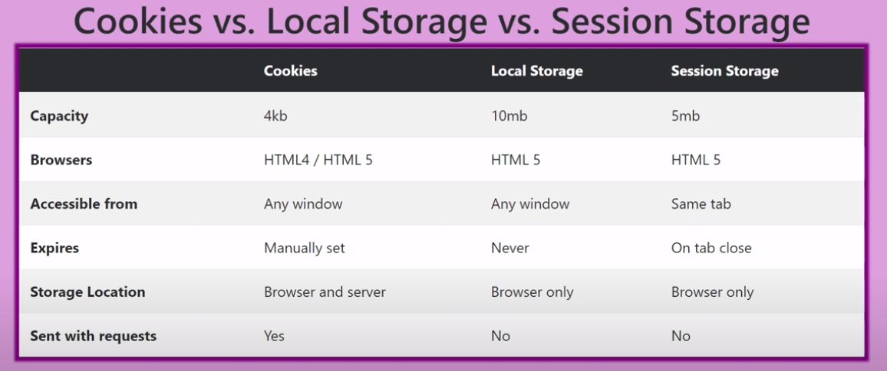
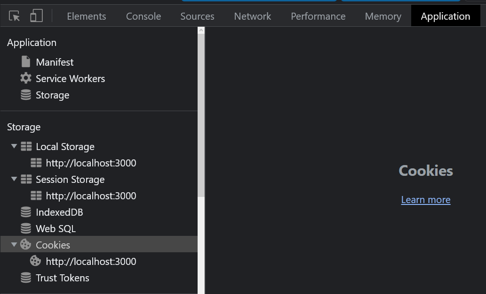
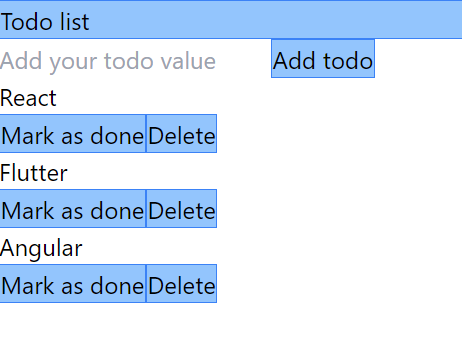

# TODO-LIST with reactjs & Tailwind

## Explanation to use

- Add what you want to do in todo list with add button.
- it's saved in localStorage. 
- You can mark it as done or delete it.
- If you delete it, it will be gone while you refresh your browser.

## Explanation of code

## Learning purpose

### JS Cookies vs local storage vs Session

- Store data inside our browser. 
- Local storage and Session Storage have lot of similarities rather than Cookies.
- Data storage LS > CS only available to one tab. L -> we need to delete ourself, no timing. 
- C> Browser and server, Sent with request 

- Inside something inside - localStorage.setItem(key, value) -> key get remove something, value to get something.
- loaclStoreage('name', 'Lak') -> console.log(loacalStorage.getItem('name)) -> lak
- localStorage.removeItem('name') -> delete from storage.
- session is same sessionStorage.setItem.
- Cookies: document.cookie = 'name=Lak; expires=' + new Date(2022, 3, 1).toUTCString(); save each new cookie on 
- separte. console.log(document.cookie)

## React useLocalStorage

- https://usehooks.com/page/3

## Extend with Time and Date

